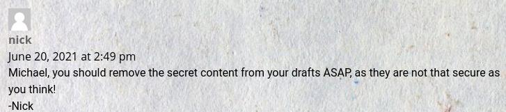
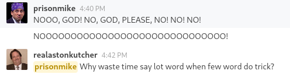
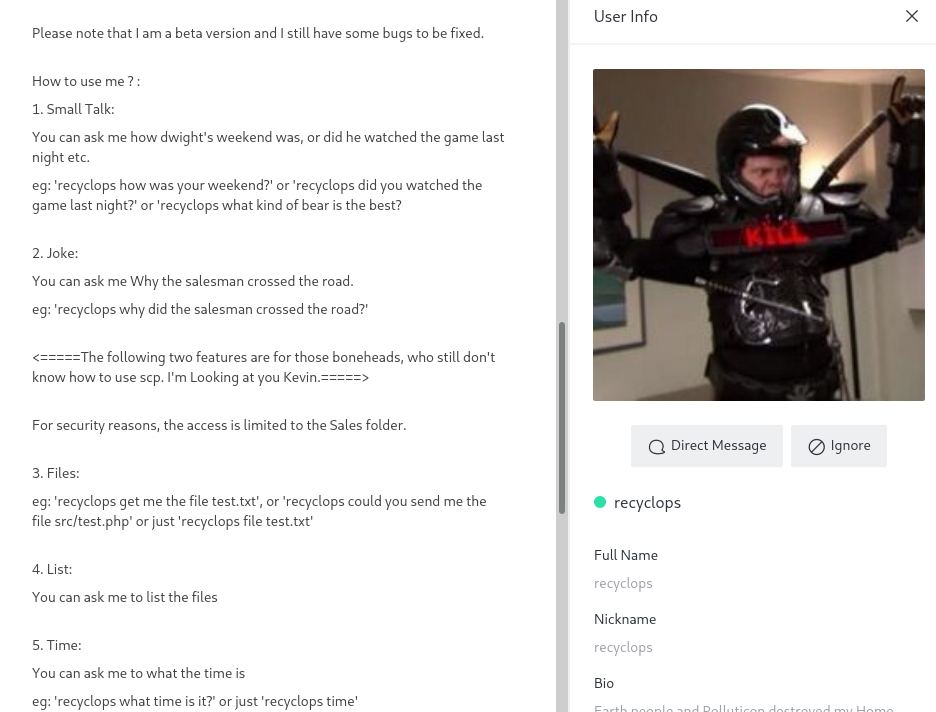
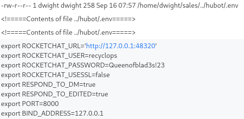
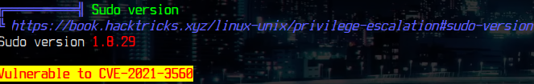

# Paper

## Scanning

Using `nmap`:

```sh
nmap -sT -sV -Pn 10.10.11.143
```

Got the result:

```
nmap -sT -sV -Pn 10.10.11.143
Starting Nmap 7.92 ( https://nmap.org ) at 2022-02-11 23:14 -03
Nmap scan report for 10.10.11.143
Host is up (0.21s latency).
Not shown: 997 closed tcp ports (conn-refused)
PORT    STATE SERVICE  VERSION
22/tcp  open  ssh      OpenSSH 8.0 (protocol 2.0)
80/tcp  open  http     Apache httpd 2.4.37 ((centos) OpenSSL/1.1.1k mod_fcgid/2.3.9)
443/tcp open  ssl/http Apache httpd 2.4.37 ((centos) OpenSSL/1.1.1k mod_fcgid/2.3.9)

Service detection performed. Please report any incorrect results at https://nmap.org/submit/ .
Nmap done: 1 IP address (1 host up) scanned in 35.17 seconds

```

Using `nikto`:

```sh
nikto -host http://10.10.11.143
```

Got the result:

```
- Nikto v2.1.6
---------------------------------------------------------------------------
+ Target IP:          10.10.11.143
+ Target Hostname:    10.10.11.143
+ Target Port:        80
+ Start Time:         2022-02-11 23:29:00 (GMT-3)
---------------------------------------------------------------------------
+ Server: Apache/2.4.37 (centos) OpenSSL/1.1.1k mod_fcgid/2.3.9
+ Server leaks inodes via ETags, header found with file /, fields: 0x30c0b 0x5c5c7fdeec240
+ The anti-clickjacking X-Frame-Options header is not present.
+ The X-XSS-Protection header is not defined. This header can hint to the user agent to protect against some forms of XSS
+ Uncommon header 'x-backend-server' found, with contents: office.paper
+ The X-Content-Type-Options header is not set. This could allow the user agent to render the content of the site in a different fashion to the MIME type
+ Retrieved x-powered-by header: PHP/7.2.24
+ Allowed HTTP Methods: POST, OPTIONS, HEAD, GET, TRACE
+ OSVDB-877: HTTP TRACE method is active, suggesting the host is vulnerable to XST
+ OSVDB-3092: /manual/: Web server manual found.
```

Adding `10.10.11.143 office.paper` to `/etc/hosts`

## Information Gathering

Users:

- Prisionmike
- Jan
- nick
- Michael
- Creed Bratton



## Wpscan

WordPress version: 5.2.3

### [Exploit 1](https://www.exploit-db.com/exploits/47690)

Content:

```
Threat Level Midnight

A MOTION PICTURE SCREENPLAY,
WRITTEN AND DIRECTED BY
MICHAEL SCOTT

[INT:DAY]

Inside the FBI, Agent Michael Scarn sits with his feet up on his desk. His robotic butler Dwigt….

# Secret Registration URL of new Employee chat system

http://chat.office.paper/register/8qozr226AhkCHZdyY

# I am keeping this draft unpublished, as unpublished drafts cannot be accessed by outsiders. I am not that ignorant, Nick.

# Also, stop looking at my drafts. Jeez!

```

We can see this secret link `http://chat.office.paper/register/8qozr226AhkCHZdyY` in draft.

Adding `10.10.11.143 chat.office.paper` to `/etc/hosts` we can access the webpage

We create a user called `1f919` and a password `password` with an temporary email:



And Scrolling the chat we find a bot with some private access:



We found a user called `dwight`

We can't inject commands, we can see the parents folders of `sales`. But after exausting HOURS of searching and finding the file `.env` inside the folder `hubot`:



Now we can connect into the ssh protocol with the username `dwight` and password `Queenofblad3s!23`.

## Privilege Escalation

Inside the machine we can scp the `linpeas.sh` script and enumerate



And we already found a [CVE](https://github.com/Almorabea/Polkit-exploit/blob/main/CVE-2021-3560.py).

We can just execute the python script and we get a root shell :D
